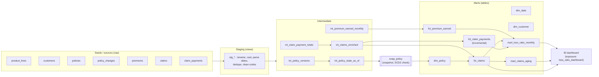

# dbt Insurance Analytics: Premium, Claims and Loss Ratio Marts

> **Portfolio project.** Independently built demonstration using synthetic data. It is not code from, or affiliated with, any current or former employer or client. Developed with AI-assisted tooling and reviewed by the author.

## Business problem

The finance and actuarial teams at **Northwind Mutual Insurance (fictional)** reconcile written premium, earned premium, claim payments and reserves by hand from several source extracts. The numbers drift between teams, nobody can say which policy terms were in force when a loss happened, and month-end loss ratio reporting takes days. This project is a dbt codebase that turns raw policy, premium and claim feeds into **trusted, documented, tested marts**: a monthly loss ratio by product line, a claims-aging inventory, and conformed dimensions, including an SCD Type 2 policy dimension built from a dbt snapshot. It runs fully offline on DuckDB and is ready to point at Snowflake or Databricks through a profile change.

## What this demonstrates

- **Layered dbt modelling**: sources/seeds, then `stg_*` (rename, type, dedupe), then `int_*` (business logic), then marts (`dim_*`, `fct_*`, `mart_*`). Each layer gets its own schema through a custom `generate_schema_name`.
- **SCD Type 2 with a dbt snapshot**: a `check` strategy over premium, limit, deductible and status. `updated_at` is set to the *business* change timestamp, and a replay helper rebuilds 24 months of history, so `dim_policy` has real versions (480 policies, 940 versions).
- **Point-in-time joins**: each claim joins to the policy version that was in force on its loss date.
- **Incremental model**: `fct_claim_payments` uses `is_incremental()`, a `merge` on `payment_id` and a configurable lookback window for late-arriving re-sends.
- **Insurance domain logic**: premium written monthly and earned pro-rata by day (stopping at cancellation), paid vs. incurred, calendar-month vs. accident-month loss ratios, rolling-12-month KPI vs. pricing target, and claim aging buckets.
- **Testing in depth**: 139 data tests (generic `unique`/`not_null`/`relationships`/`accepted_values`, plus project-local generic tests `expression_is_true`, `non_negative`, `accepted_range` and `unique_combination_of_columns`), 5 singular business-rule tests, 2 dbt **unit tests**, and source freshness config.
- **Handling data quality**: injected issues (duplicates, stale versions, mixed date formats, unclean codes, orphans, negative reserves, reported-before-loss) are fixed in staging or surfaced as warn-severity tests.
- **Cross-warehouse portability**: dbt cross-database macros (`dateadd`, `datediff`, `date_trunc`, `hash`, `date_spine`) plus `adapter.dispatch` macros for date parsing and ISO weekday on DuckDB, Snowflake and Databricks.
- **Engineering hygiene**: documented models and columns, exposures, `dbt docs generate`, sqlfluff with the dbt templater, ruff, pytest (unit + end-to-end), Makefile, CI and Dockerfile.

## Architecture



## Tech stack

| Area | Choice |
| --- | --- |
| Transformation | dbt-core 1.12.5 |
| Local warehouse | DuckDB 1.5.6 via dbt-duckdb 1.11.0 |
| Cloud-ready targets | Snowflake, Databricks (commented profiles, `env_var()` placeholders) |
| Helpers | Python 3.11+ (stdlib + `duckdb`), programmatic `dbtRunner` |
| Quality | dbt data + unit tests, sqlfluff 4.3 (dbt templater), ruff 0.16, pytest 9 |
| Delivery | Makefile, GitHub Actions, Dockerfile |

## Project layout

```
dbt-insurance-analytics/
├── dbt_project.yml            # layers, schemas, seed column types, vars
├── profiles.yml               # project-local DuckDB profile (no secrets)
├── profiles.example.yml       # DuckDB + commented Snowflake/Databricks targets
├── seeds/                     # 7 deterministic synthetic CSVs (+ _seeds.yml)
├── models/
│   ├── staging/               # _sources.yml (freshness), stg_* + _stg_models.yml
│   ├── intermediate/          # int_* + _int_models.yml
│   └── marts/
│       ├── core/              # dim_date, dim_customer, dim_policy, fct_* (+ yml)
│       ├── finance/           # mart_loss_ratio_monthly (+ unit test)
│       ├── claims/            # mart_claims_aging (+ unit test)
│       └── exposures.yml      # BI dashboard + actuarial extract
├── snapshots/snap_policy.yml  # SCD2, check strategy
├── macros/                    # surrogate_key, cents_to_dollars, safe_divide, dedupe,
│                              # parse_date (dispatch), iso_day_of_week (dispatch),
│                              # raw_source, generate_schema_name
├── data_tests/
│   ├── generic/               # expression_is_true, non_negative, accepted_range,
│   │                          # unique_combination_of_columns
│   └── singular/              # 5 business-rule assertions
├── src/insurance_analytics/   # seed_generator, snapshot_history, exporter, logging
├── scripts/                   # generate_seeds.py, build_snapshot_history.py, export_marts.py
├── tests/                     # pytest: unit + end-to-end export test
├── docs/sample_output/        # real CSV + markdown output from a run
├── warehouse/                 # local DuckDB file (git-ignored)
├── .github/workflows/ci.yml
├── Makefile  Dockerfile  .sqlfluff  pyproject.toml
└── requirements.txt  requirements-dev.txt  .env.example  LICENSE
```

## Quickstart

```bash
python3 -m venv .venv && source .venv/bin/activate
make install           # pinned deps + editable helper package

make build             # fresh DuckDB + seed + 24 snapshot replays + dbt build
make export            # docs/sample_output/*.csv + summary.md
make test              # pytest (builds the warehouse first if it is missing)
make lint              # ruff + sqlfluff (dbt templater)
make docs              # dbt docs generate  (then: dbt docs serve --profiles-dir .)
```

Plain dbt also works on a cold checkout, offline:

```bash
dbt build --profiles-dir .      # seeds -> models -> snapshot -> tests in DAG order
```

Run plain dbt only once and every policy has a single version in `dim_policy`. `make build` replays the snapshot over month-ends first, so the SCD2 history is realistic (see Design decisions).

## Sample output

Real output from `make run` (trimmed):

```
snapshot_history msg="snapshot history complete" snapshots=24 seconds=77.4
Found 20 models, 139 data tests, 7 seeds, 1 snapshot, 7 sources, 2 exposures, 519 macros, 2 unit tests
59 of 171 WARN 4 relationships_stg_claims_policy_id__policy_id__ref_stg_policies_  [WARN 4]
93 of 171 OK created sql incremental model analytics_marts.fct_claim_payments .. [OK]
104 of 171 OK snapshotted analytics_snapshots.snap_policy ...................... [OK]
110 of 171 PASS assert_earned_not_greater_than_written ......................... [PASS]
111 of 171 PASS assert_written_premium_reconciles_to_source .................... [PASS]
126 of 171 PASS assert_policy_versions_do_not_overlap .......................... [PASS]
140 of 171 PASS assert_no_orphaned_claims ...................................... [PASS]
156 of 171 PASS assert_loss_ratio_within_sane_bounds ........................... [PASS]
Done. PASS=168 WARN=1 ERROR=0 SKIP=0 NO-OP=2 REUSED=0 TOTAL=171
```

The single WARN is intentional. The source feed contains 4 claims against non-existent policies. They are flagged at staging and excluded from the marts.

From [`docs/sample_output/summary.md`](docs/sample_output/summary.md):

| product_line_code | earned_premium | paid_loss | incurred_loss | claims | incurred LR | rolling 12m LR | target |
| --- | --- | --- | --- | --- | --- | --- | --- |
| CPROP | 332416.75 | 70344.16 | 76958.45 | 13 | 0.2315 | 0.3065 | 0.550 |
| GLIAB | 331359.83 | 146719.04 | 196093.73 | 29 | 0.5918 | 0.3614 | 0.620 |
| PAUTO | 176160.36 | 123315.34 | 130053.62 | 71 | 0.7383 | 0.8827 | 0.680 |
| HOME | 156489.45 | 58184.24 | 59874.49 | 36 | 0.3826 | 0.4462 | 0.580 |
| RENT | 17964.08 | 11123.61 | 11123.61 | 27 | 0.6192 | 0.2642 | 0.500 |

SCD2 history for one policy (`dim_policy`):

| policy_id | version | status | annual_premium | coverage_limit | deductible | effective_from | effective_to | is_current |
| --- | --- | --- | --- | --- | --- | --- | --- | --- |
| P000015 | 1 | ACTIVE | 2192.88 | 100000.00 | 1000.00 | 2024-06-30 | 2024-09-09 | False |
| P000015 | 2 | ACTIVE | 2523.94 | 250000.00 | 500.00 | 2024-09-09 | 2025-06-30 | False |
| P000015 | 3 | EXPIRED | 2523.94 | 250000.00 | 500.00 | 2025-06-30 | 9999-12-31 | True |

## Configuration

| Setting | Where | Default |
| --- | --- | --- |
| Target | `DBT_TARGET` env var | `dev` (DuckDB) |
| DuckDB file | `DBT_DUCKDB_PATH` env var | `warehouse/insurance.duckdb` |
| Business as-of date | `--vars '{as_of_date: ...}'` | `2025-12-31` |
| Incremental lookback | var `payments_lookback_days` | `3` |
| Credible-premium floor for LR bounds test | var `min_credible_earned_premium` | `25000` |
| Read raw via `ref(seed)` vs `source()` | var `raw_from_seeds` | `true` on DuckDB, `false` elsewhere |
| Raw schema on a warehouse | var `raw_schema` | `<target schema>_raw` |

To use Snowflake or Databricks, install the adapter (`dbt-snowflake` / `dbt-databricks`), uncomment the target in `profiles.example.yml`, export the variables listed in `.env.example`, and run with `--target`. The cloud targets have **not** been run against a live warehouse for this portfolio (no credentials, offline by design). The SQL avoids DuckDB-only syntax, and dialect-specific pieces are dispatched.

## Design decisions

- **Snapshot replay for realistic SCD2.** A snapshot only records what it observes. In production it runs on a schedule and history builds up over time. Locally, `scripts/build_snapshot_history.py` calls dbt programmatically once per month-end with `as_of_date` set, so `int_policy_state_as_of` shows the book as it stood on that day. Several changes inside one month collapse into one version, which is exactly what a monthly snapshot would capture.
- **`check` strategy + business `updated_at`.** The source has no reliable "last modified" column, so the check columns decide when a new version starts. `updated_at: state_updated_at` makes `dbt_valid_from` the endorsement, cancellation or expiry date rather than the wall-clock run time. `dim_policy` then back-dates version 1 to the policy effective date, giving gap-free `[effective_from, effective_to)` ranges that a singular test enforces.
- **Seeds vs. sources (`raw_source()` macro).** Sources do not create DAG edges to seeds, so a cold `dbt build` would race the seed load (I reproduced this). On DuckDB, staging reads `ref(seed)`. On a warehouse it reads `source()`, where freshness is defined.
- **Premium accounting.** Each monthly installment is *written* at the start of its coverage month and *earned* pro-rata by day, stopping at cancellation or the as-of date. Earned is rounded once per installment, and the second calendar-month segment takes the remainder. The `assert_earned_not_greater_than_written` test caught a one-cent drift from per-segment rounding before this fix.
- **Two loss ratio views.** Calendar-month *paid* LR answers "what did we pay this month". Accident-month *incurred* LR (paid to date + case reserve, by loss month) answers "how did business earned this month perform". Monthly figures are noisy on a small book, so the dashboard KPI and the bounds test use trailing-12-month LR.
- **Own generic tests instead of dbt_utils.** `dbt deps` needs network access to the dbt hub. Four small project-local generic tests keep the build fully offline and are easy to read.
- **Schema naming.** In `dev`/`ci`, custom schemas are prefixed (`analytics_staging`, `analytics_marts`), so developers and CI never touch production. In `prod`, they are used verbatim.
- **Money as integer cents in raw, `decimal(18,2)` dollars from staging on**, so there is no floating-point arithmetic on amounts.

## Security considerations

- No credentials in the repo. `profiles.yml` is DuckDB-only. Cloud credentials are read with `env_var()`, and `.env`/`.env.*` are git-ignored, with `.env.example` holding placeholders only.
- Prefer Snowflake key-pair auth or Databricks OAuth/service principals over passwords and PATs in production (noted in `profiles.example.yml`).
- All data is synthetic: names come from small fictional lists, and emails use the reserved `example.com` domain (enforced by a test).
- The exporter opens DuckDB **read-only**. CI uses `permissions: contents: read`, and the Docker image runs as a non-root user.
- The generated `target/` (compiled SQL, docs), `logs/` and `*.duckdb` are git-ignored.

## Testing

| Layer | What | Result (this run) |
| --- | --- | --- |
| dbt data tests | 139 (generic + custom generic + 5 singular) | 138 pass, 1 intentional warn |
| dbt unit tests | earned-premium proration, claims-aging buckets | 2 pass |
| dbt build total | 7 seeds, 20 models, 1 snapshot, tests | PASS=168 WARN=1 ERROR=0 |
| pytest | 17 unit test cases + 4 end-to-end tests | 21 passed |
| Lint | `ruff check`, `ruff format --check`, `sqlfluff lint` (dbt templater) | clean |
| Docs | `dbt docs generate` | succeeds (catalog written to `target/`) |

The end-to-end test runs `scripts/export_marts.py` against the built warehouse. It checks reconciliation (exported earned premium = `fct_premium_earned`), contiguous SCD2 history, and that the aging buckets hold every open claim. If the warehouse does not exist, a session fixture builds it first. Another test regenerates the seeds and asserts they are byte-identical to the committed CSVs, and CI repeats that check with `git diff --exit-code`.

`dbt source freshness` is configured (warn 1–2 days, error 3–7 days) and correctly reports **STALE** against the static 2025 synthetic data. `make freshness` and CI therefore run it as an informational step.

## Limitations

- Incurred loss is reported incurred (paid + case reserve). There is no IBNR, loss development or reserve history, so calendar-month incurred is not modelled.
- Return premium on cancellation is not modelled. Earned stops at cancellation, but the cancelled installment stays fully written.
- Snapshot replay takes about 80 s locally because it runs 48 dbt invocations. Regenerating the seeds under an existing snapshot rewrites "history", so `make history` always starts from a fresh warehouse.
- The Snowflake and Databricks targets are compile-ready but untested against live warehouses. The Docker image was not built here because no Docker daemon was available.
- The book is small (480 policies, 176 claims), so monthly loss ratios by line are volatile by nature.

## Future enhancements

- Loss development triangles (accident month × development month) and a chain-ladder IBNR estimate.
- dbt model contracts and versions on the marts consumed by BI. Add the semantic layer / MetricFlow for loss ratio metrics.
- Slim CI with `state:modified+` and deferral against a production manifest.
- Reserve-change history (a snapshot on claims) for calendar-month incurred.
- Elementary or re_data style anomaly monitoring on premium and payment volumes.

## License

MIT, see [LICENSE](LICENSE). Copyright 2026 Vijaya Lakshmi Kompalli.
